# 💼 PubxStudio — Corporate Overview & Business Value Proposition

PubxStudio is a self-hosted, private, and highly optimized enterprise content generation and multi-channel publication workspace. In an era where digital presence dictates market capture, marketing teams, developer advocates, and editorial boards face a constant struggle to balance **content speed, absolute data privacy, brand consistency, and soaring SaaS subscription costs**. 

PubxStudio solves these challenges by providing a consolidated, self-hosted, multi-agent editorial cockpit.

---

## 🎯 Strategic Business Challenges Solved

### 1. Zero-Trust Data Privacy (Bring Your Own Key - BYOK)
*   **The Problem**: Using third-party SaaS content platforms often forces organizations to upload confidential product specs, future roadmaps, and intellectual property onto shared servers, where they may be logged or used to train public LLM models.
*   **The PubxStudio Solution**: Operating entirely self-hosted and on-premise, PubxStudio runs client-side. Your corporate editorial briefs, RAG context, and files are transmitted directly to the API endpoints of your selected provider (Anthropic, OpenAI, or Google) using *your* keys. No intermediary servers, no external tracking, and zero leakage of proprietary business intelligence.

### 2. Radical SaaS Consolidation & Cost Reductions
*   **The Problem**: Modern marketing operations require a fragmented list of expensive monthly subscriptions: AI copywriting tools, vector graphic software, SEO analysis suites, social media schedulers, and version-tracking tools.
*   **The PubxStudio Solution**: PubxStudio unifies these functions into a single dashboard. 
    *   Replaces generic copywriters with a custom **Dual-Agent Editorial Workflow**.
    *   Replaces stock images or paid designers with an automatic **SVG Media Agent** creating premium blueprints.
    *   Replaces premium SEO crawlers with an integrated, one-click **SEO Keyword Auto-Optimizer**.

| Displaced Tool Category | Estimated Monthly Cost (per seat) | PubxStudio Equivalent | Corporate Savings |
| :--- | :--- | :--- | :--- |
| **Premium AI Copywriting** | $40 - $90 | Dual-Agent Engine | **Consolidated** |
| **SEO Density & Optimization** | $30 - $60 | Real-Time SEO Optimizer | **Consolidated** |
| **Vector Design / Diagrams** | $25 - $50 | SVG Media Blueprint Agent | **Consolidated** |
| **Social Schedulers & Slices** | $15 - $40 | Decoupled Publishing Plugins | **Consolidated** |
| **Enterprise Cloud Storage** | $10 - $20 | Native Offline ZIP Bundler | **Consolidated** |
| **TOTAL** | **$120 - $260 / mo** | **PubxStudio Suite (BYOK API)** | **Save up to 90%** |

### 3. Institutional Brand Consistency (Dual-Agent Guardrails)
*   **The Problem**: Relying on different authors or generic AI prompts leads to "style drift," which dilutes brand identity across channels.
*   **The PubxStudio Solution**: A rigorous **Dual-Agent pipeline** ensures that every generated asset is first drafted, then immediately audited by a **Domain Quality Review Agent**. This agent automatically corrects formatting, refines terminology to target the exact target audience, and cleans up generic conversational text, ensuring a premium, consistent voice.

### 4. Zero-Friction Multi-Channel Distribution
*   **The Problem**: Restructuring a single article into a newsletter, a LinkedIn post, and a long Twitter/X thread manually takes hours, with constant formatting mistakes and post truncation due to platform limit violations.
*   **The PubxStudio Solution**: One click generates tailored assets for **LinkedIn**, **Twitter/X Threads**, **Substack**, **Medium**, and **SEO Profiles** in parallel. The built-in **Character Limits Guard** automatically intercepts the process, displaying live indicators and preventing accidental truncated publishing.

---

## 📈 Deep-Dive: Core Business Features

### 🚀 Category-Tailored Personalization
Rather than generating generic marketing text, PubxStudio features six high-performance, dynamic domain category presets that instantly optimize system instructions to speak directly to specific buyers:
*   **Engineering & Code**: Generates rigorous, dense text with fully verified code blocks, speaking developer-to-developer.
*   **AI & ML**: Leverages deep technical specifications, data models, and neural architecture terms.
*   **Business Strategy**: Emphasizes ROI charts, efficiency margins, KPIs, and corporate metrics.
*   **Product Design**: Focuses on user-experience maps, UX design patterns, and interface wireframes.
*   **Research**: Uses formal citation systems and academic structuring.
*   **General**: Crisp, editorial newsletters for broad target audiences.

### 🎨 SVG Media Agent (Instant Conceptual Diagrams)
Stock photos look generic and lower brand trust. When a reasoning engine class is selected (e.g. Claude 4, GPT-4o, Gemini 1.5 Pro), the system spawns a design agent to create professional, dark-themed conceptual SVG blueprints and places them directly inside the article bundle.
*   **Result**: Visual indicators on social feeds that significantly increase click-through rates (CTR) and user engagement.

### 🔍 Organic Acquisition Boost (SEO Optimizer)
SEO stands as the highest-ROI channel for long-term customer acquisition. PubxStudio includes a real-time Focus Keyphrase analyzer that evaluates density, title presence, and content structure. With a single click, the **SEO Auto-Optimizer** rewrites copy to target the perfect 1.5% - 2.5% density curve.
*   **Result**: Drastically reduced Customer Acquisition Cost (CAC) by driving organic organic traffic without manual SEO copywriting fees.

### 🔒 Editorial Controls & HITL Compliance
To safeguard company communications, the workbench features:
*   **Granular Version Rollbacks**: Allowing copywriters to test and safely revert edits instantly.
*   **Approved for Publication Toggles**: Setting strict editorial blocks that freeze assets, preventing unauthorized accidental publishing.
*   **Local Bundling**: Pure client-side packaging in standard folders and ZIP files, meaning your distribution archives are permanently backed up on local drives.

---

## 💼 Return on Investment (ROI) Projections

For a typical mid-sized marketing, agency, or Developer Relations (DevRel) team producing **10 high-value articles per month** with multi-channel distribution:

```mermaid
gantt
    title Content Lifecycle Time Savings (Minutes per Article)
    dateFormat  X
    axisFormat %s
    
    section Traditional Method
    Research & Draft           :active, a1, 0, 120
    Manual SEO Polish          :active, a2, 120, 180
    Design Visual Graphic      :active, a3, 180, 240
    Social Snippet Re-writing  :active, a4, 240, 300
    Manual Publishing Checks   :active, a5, 300, 330
    
    section PubxStudio Workspace
    RAG Workspace Input        :crit, b1, 0, 15
    Dual-Agent Execution       :crit, b2, 15, 20
    Real-Time SEO Optimizer    :crit, b3, 20, 25
    Interactive HITL Validation:crit, b4, 25, 45
    One-Click Direct Publish   :crit, b5, 45, 50
```

*   **Time Spent (Traditional)**: ~5.5 Hours per article (including design, SEO refinement, social adaptations, and channel-by-channel manual publishing).
*   **Time Spent (PubxStudio)**: ~50 Minutes per article.
*   **Operational Efficiency Gain**: **85% reduction in time-to-market**. 
*   **Strategic Outcome**: Your creative staff shifts from manual copy formatting to high-value strategic research, scaling your content output velocity by **6x** without increasing headcount.
