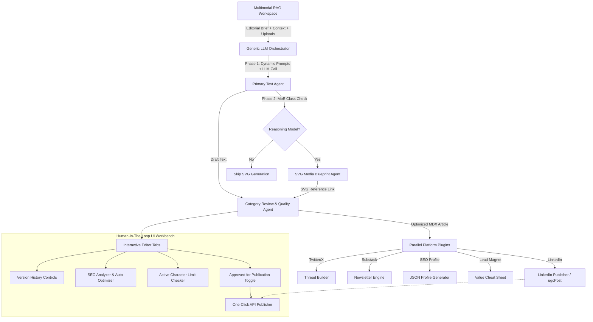

# 🛡️ PubxStudio — Premium Multi-Agent Content Workspace & Distribution Engine

PubxStudio is a high-fidelity, self-hosted, offline-capable multi-agent content generation and publishing workspace. Designed for ultimate privacy and developer convenience, it enables users to input topic briefs, attach rich multi-modal context (images, links, references), generate premium structured content targeted at specific domain categories, run auto-optimizers, maintain local drafts version control, and publish directly to social networks with a fully interactive **Human-in-the-Loop (HITL)** validation system.

---

## 🏗️ Architectural Overview

PubxStudio is organized into four main layers that separate interface, logic, static configuration, and dynamic orchestration:



---

## ⚡ Core Capabilities

### 1. Generic LLM Orchestration Layer
PubxStudio supports three primary cloud-based AI providers. Users supply their own API keys via the **Settings** modal, ensuring data sovereignty:
*   **Anthropic Claude**: Backed by the new **Claude 4 model family** (defaulting dynamically to `claude-4-sonnet-latest` and `claude-4-haiku-latest`).
*   **OpenAI Chat**: Leverages reasoning models (`gpt-4o`, `gpt-4o-mini`, `o1-preview`).
*   **Google Gemini**: Backed by the Gemini API (`gemini-1.5-pro`, `gemini-1.5-flash`).

*Dynamic Model Fetching (Requirement 21)*: Rather than relying solely on hardcoded identifiers, the engine dynamically fetches available active models directly from the respective cloud providers' model listing APIs at runtime, adjusting to API updates seamlessly.

### 2. Category Optimization & Dual-Agent Workflow
Every piece of content generated undergoes a rigorous dual-agent workflow:
1.  **Creation Agent**: Composes standard drafts using Category Domain directives customized for six specific presets:
    *   **General**: Universal editorial style.
    *   **Business Strategy**: Formatted with KPI trackers, revenue metrics, and ROI tables.
    *   **Product Design**: Highlights user empathy loops, interactive UI architectures, and layout wireframes.
    *   **Research**: Incorporates formal literature structures, citation models, and structured data summaries.
    *   **Engineering & Code**: Features highly dense Markdown, robust TS/JS/Python blocks, and architecture blueprints.
    *   **AI & ML**: Tailored with neural network details, weights, datasets, and mathematical formulations.
2.  **Quality Review Agent**: Review and refinement agent intercepting the primary copy. It checks the tone, cleans up preambles, refines terms, and generates category-perfect, ready-to-use content.

### 3. Mixture of Experts (MoE) & SVG Media Agent
When a reasoning or MoE class model is selected (e.g. Claude 4, GPT-4o, Gemini 1.5 Pro), the system triggers a **Visual Media Agent** in parallel. This sub-agent generates beautifully customized concept blueprints in SVG vector format (styled with premium dark themes, neon borders, and elegant grids) and embeds them directly inside the final markdown article bundle automatically.

### 4. Interactive SEO Analyzer & Auto-Optimizer
Integrated directly into the primary editing workspace:
*   **SEO Inspector**: Displays focus keyword length, density percentage (aiming for the optimal 1.5% - 2.5% sweep), and title presence warnings.
*   **Auto-Optimizer Server Action**: With one click, passes copy and keywords through a semantic re-writer to automatically increase keyword density, structure H2/H3 headers, and ensure high-ranking indexability without breaking code blocks or markdown markup.

### 5. Multi-Platform Plugin Registry
The distribution workflow is built around modular, decoupled plugins defined under `studio/src/app/constants.ts`:
*   `article`: MDX bundle with clean YAML Frontmatter.
*   `linkedin`: Character-constrained post targeting LinkedIn feeds.
*   `substack`: Structured newsletter asset.
*   `twitter`: Thread-segmented text generator.
*   `seo`: Serialized JSON SEO structural profile.
*   `leadmagnet`: Instantly downloadable PDF/Markdown cheat sheet.

Users select platforms via checkboxes in the cockpit, instructing the LLM to strictly spend tokens only on selected targets.

### 6. Granular Local Version Control
Allows users to confidently make changes in the editor:
*   Maintains localized stack history lists for each platform tab.
*   Supports manual drafts bookmarking with visual change notes.
*   Allows instantaneous state rollbacks to restore historical milestones.

### 7. Character Limit Guards & Direct Publishers
*   **Dynamic Visual Status Cards**: Continuously audits post lengths vs. platform limits (e.g., LinkedIn 3,000 characters, Twitter 280 characters per tweet).
*   **Direct API Publishers**: Integrated connectors for personal profiles and organization feeds (using modern `/v2/posts` and UGC APIs for LinkedIn).
*   **Safety Guards**: Intercepts accidental publishing commands by highlighting character limit breaches via interactive confirmation guards.

---

## 💻 Tech Stack & Design System

*   **Framework**: Next.js 16 (React App Router) providing server-side dynamic actions and fast static builds.
*   **Language**: Strict TypeScript for static type guarantees.
*   **Styling**: Pure **Vanilla CSS** tokens mapped directly inside `page.tsx` for optimal performance. The interface is meticulously designed to wow users:
    *   *Theme*: Harmonic dark aesthetics (`#060606` dark backgrounds, sleek border gradients).
    *   *Typography*: High-end fonts (`Instrument Serif` for luxury headlines, `DM Sans` for body copy, and `JetBrains Mono` for code elements).
    *   *Components*: Custom frosted-glass panels (Backdrop Filters), vibrant connection status badges (Red/Amber/Green), and micro-animations for hover states.
*   **Offline Utilities**: Custom offline-ready ZIP bundler written in pure client-side JavaScript (`studio/src/app/utils/zip.ts`) without external NPM dependencies, compiling raw markdown files, images, and SVG diagrams into a unified structure instantly.

---

## 🚀 One-Click Installation & Running

PubxStudio is fully optimized to run on local laptops or cloud servers (Vercel, Firebase App Hosting, etc.) with extreme speed.

### Direct Launch
Use the bundled cross-platform launchers at the repository root to launch with a single double-click:
*   **UNIX / macOS / Linux**:
    ```bash
    ./start.sh
    ```
*   **Windows**:
    ```cmd
    start.bat
    ```

The launcher will verify package requirements, run a dependency install if missing, spin up the local development server at `http://localhost:3001`, and open your default browser.

### Manual Launch
1.  Navigate to the Next.js workspace:
    ```bash
    cd studio
    ```
2.  Install dependencies:
    ```bash
    pnpm install  # or npm install
    ```
3.  Boot the development server:
    ```bash
    npm run dev
    ```

---

## 📂 Codebase File Map

*   `studio/src/app/page.tsx`: The primary dashboard interface, holding client state managers, modal forms, PWA user guides, and workbench interactive panels.
*   `studio/src/app/actions.ts`: Core server-side orchestrator layer. Houses the universal LLM connector APIs, sub-agents (media, review, SEO), dynamic model listings, and direct publishing adapters.
*   `studio/src/app/constants.ts`: System declarations registry, containing custom category prompts, default directives, and publishing plugin schemas.
*   `studio/src/app/utils/zip.ts`: Highly reliable client-side ZIP packager.
*   `published/`: Local persistent output directory housing the final generated folder bundles organized cleanly by article slug.
