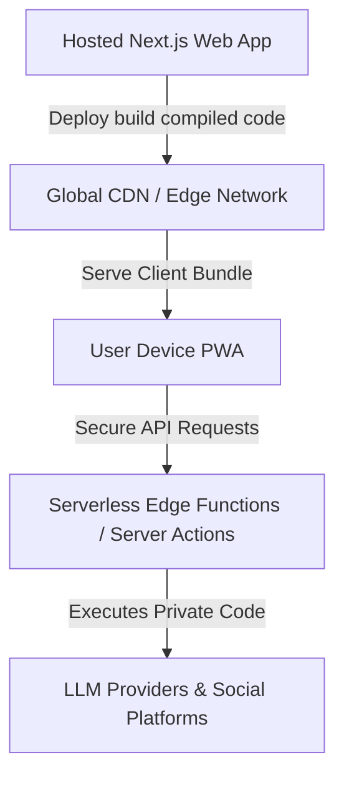
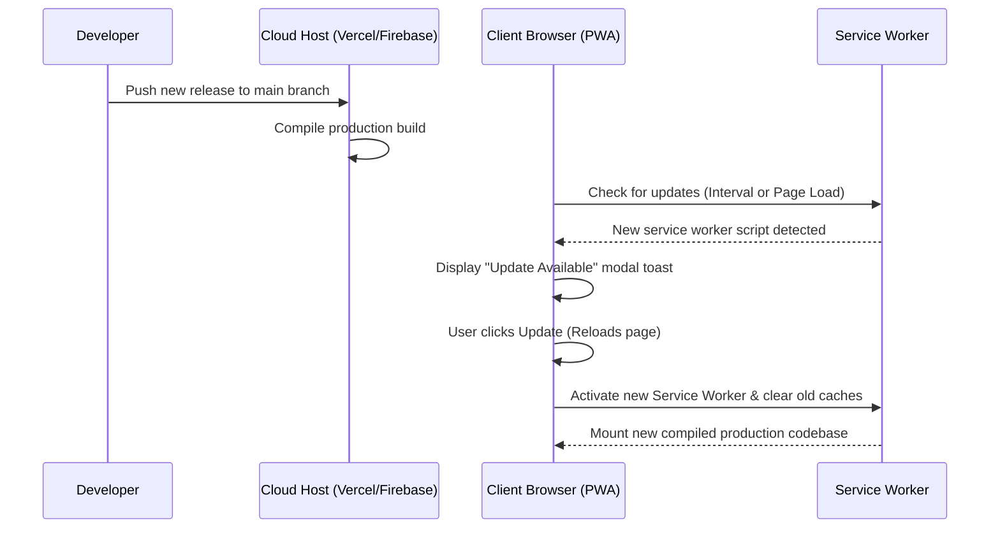

# Feasibility Study & Distribution Plan: PubxStudio PWA (Step 23)

This document provides a highly structured architectural assessment and deployment model for packaging, distributing, and scaling **PubxStudio** to end-users as a premium, cross-platform Progressive Web Application (PWA).

---

## 1. Distribution & Codebase Protection Model

To achieve the objective of distributing the application **without sharing the raw Next.js codebase**, we must shift from a *local developer server* (where the user clones the Git repo and runs `./start.sh`) to a **Hosted Software-as-a-Service (SaaS) PWA Model**.

### 🛡️ Code Protection Mechanics
* **Compiled Clientside Asset Delivery**: When hosted, Next.js compiles the React framework code into highly optimized, minified, and obfuscated JavaScript chunks. The raw React component structures, styling layouts, and utility directories are completely secure.
* **Encapsulated Server Action Isolation**: All proprietary orchestration code, LLM clients, and platform posting modules reside inside Next.js Server Actions. These execute exclusively on the secure cloud runtime (e.g. Vercel Serverless / Google Cloud Run). The client's browser only receives the returned JSON result objects. **Zero server code is ever sent to the user's device.**

---

## 2. PWA Packaging & Cross-Platform Native Installers

A Progressive Web App is naturally installable on **macOS, Windows, iOS, and Android** directly from modern browsers (Chrome, Safari, Edge) without going through App Stores. However, to package the application as dedicated store-ready files (`.dmg`/`.pkg`, `.msi`/`.exe`, `.apk`, `.ipa`), we can utilize **PWABuilder** or **Tauri**.

### Comparison of Packaging Technologies

| Technology | Platform Coverage | Auto-Update Mechanism | Code Protection Level | Store Readiness |
| :--- | :--- | :--- | :--- | :--- |
| **Pure Hosted PWA**  *(Recommended)* | macOS, iOS, Windows, Android | **Instant / Automatic** (Service Worker syncs fresh server assets instantly) | **100% Secure** (Server actions run on cloud; client only gets compiled JS) | Direct install via browser; can be added to homescreens |
| **PWABuilder**  *(Windows, Android, macOS)* | macOS, Windows, Android, iOS | **Automatic** (Wraps the hosted PWA URL; updates on the server instantly update the app wrapper) | **100% Secure** (Wrapper points to cloud engine) | Generates `.appx` (Windows Store), `.apk` (Google Play), and Xcode wrapper |
| **Tauri**  *(Local Client)* | macOS, Windows, Linux, iOS, Android | Needs Tauri Auto-Updater + private release storage | **Moderate** (Rust wraps compile assets locally; raw code is protected, but client runs offline) | Stores-ready native packages |

---

## 3. The Local File Saving Feasibility Challenge (CRITICAL)

Currently, PubxStudio runs locally, meaning it can import the Node.js `fs/promises` library inside `actions.ts` to write generated assets directly onto the user's physical machine under the project path `published/${slug}/`.

In a **hosted/cloud deployment**, server-side `fs` calls write to the serverless container's temporary virtual disk, which is ephemeral and **does not exist on the user's computer**.

### 💡 The Solution: Browser File System Access API
To retain local file bundle generation while hosted securely, we must replace Server Action file writes with modern client-side browser storage APIs:

1. **Browser Native File System API** (`window.showDirectoryPicker`):
   Allows PubxStudio (with user permission) to select a local folder on their Mac/Windows machine once, and then write files, nested platforms folders, and image binaries directly to that directory from clientside JS.
2. **Dynamic ZIP Bundle Downloads** (`JSZip`):
   Bundle the entire platform asset directory (`published/[slug]/...`) into a beautifully structured, compressed `.zip` archive on the client side and trigger an instant download event. This is highly compatible and runs flawlessly across macOS, Windows, iOS, and Android out-of-the-box.

---

## 4. Hosting Platform & CDN Analysis

We evaluate four primary cloud systems to host Next.js, support serverless Server Actions, and distribute assets globally via low-latency CDNs.

### 1. Vercel (Recommended Core Hosting)
* **Pros**: 
  * Native environment for Next.js, maintaining zero-config deployments.
  * Server Actions deploy seamlessly as global Edge/Serverless functions.
  * Exceptional global CDN (Vercel Edge Network) routing assets close to the client device.
  * Built-in serverless image optimization.
* **Cons**: Team plans cost $20/month if scaling to multi-member collaborative teams.

### 2. Firebase App Hosting (Recommended for Push Notification Suite)
* **Pros**:
  * Native Cloud Run backend automatically compiles and hosts Next.js SSR applications.
  * Built-in support for **Firebase Cloud Messaging (FCM)** for cross-platform Web Push notifications.
  * Unified backend database services (Firestore, Authentication, Storage) if user databases are added in the future.
* **Cons**: Setup is slightly more complex compared to Vercel's one-click Git link.

### 3. Azure Static Web Apps / Container Apps
* **Pros**: Enterprise-grade security compliance.
* **Cons**: Extremely high setup complexity for Next.js SSR/Serverless routing; slower deployment cycles.

### 4. Raw CDNs (Cloudflare / Cloudfront)
* **Pros**: Low cost.
* **Cons**: Incapable of running Next.js Server Actions dynamically unless the entire project is rewritten to a decoupled Static Export (SSG) + independent Go/Node API server.

---

## 5. Auto-Updates & Notification Architecture

### 🔄 Auto-Update Engine (Service Worker Lifecycle)
In a Hosted PWA model, auto-updates are managed through the Service Worker (`sw.js`). When a developer pushes a release to Vercel/Firebase:
1. The client browser detects a new Service Worker build in the background.
2. A beautiful, theme-colored notification toast slides up: `⚡ PubxStudio Update Available! [Reload to Update]`.
3. Clicking reload clears the cache and mounts the fresh release instantly.

### 🔔 Update Notification System (Web Push API)
To send push notifications directly to the user's notification center (even when PubxStudio is closed):
* **Backend**: **Firebase Cloud Messaging (FCM)**. It provides a robust, cross-platform server-to-device bridge that is completely free of charge.
* **Client**: Register a public VAPID key in the browser PWA Service Worker. The user approves a standard permission dialogue.
* **Engagement**: Trigger target announcement notifications (e.g. `"New Feature Released: Medium Posting is now live!"`) directly via an admin portal or simple server script.

---

## 6. Recommended Implementation Roadmap

If we proceed with Step 23, the execution path consists of:

1. **Step 1: File Storage Rearchitecture (Local -> Browser)**
   * Introduce client-side `JSZip` bundle packaging for "Save Local Bundle" actions.
   * Add support for browser-native folder picks to download slug directories without local Node.js server dependencies.
2. **Step 2: Service Worker & PWA Manifest Setup**
   * Configure `next-pwa` or clean workbox Service Worker routines inside `studio` to handle state caches, cache invalidations, and update notifications.
3. **Step 3: Web Push FCM Integration**
   * Set up a free Firebase project. Include FCM registration script inside layout boot sequences to prompt for notification authorization.
4. **Step 4: Target Cloud Deployment**
   * Link the GitHub repository securely to **Vercel** or **Firebase App Hosting**. Define live production variables (keys, domains).
5. **Step 5: Store Wrapping via PWABuilder**
   * Compile Android `.apk`, Windows `.msix`, and macOS wrapper binaries for distribution from a clean static downloads index.
